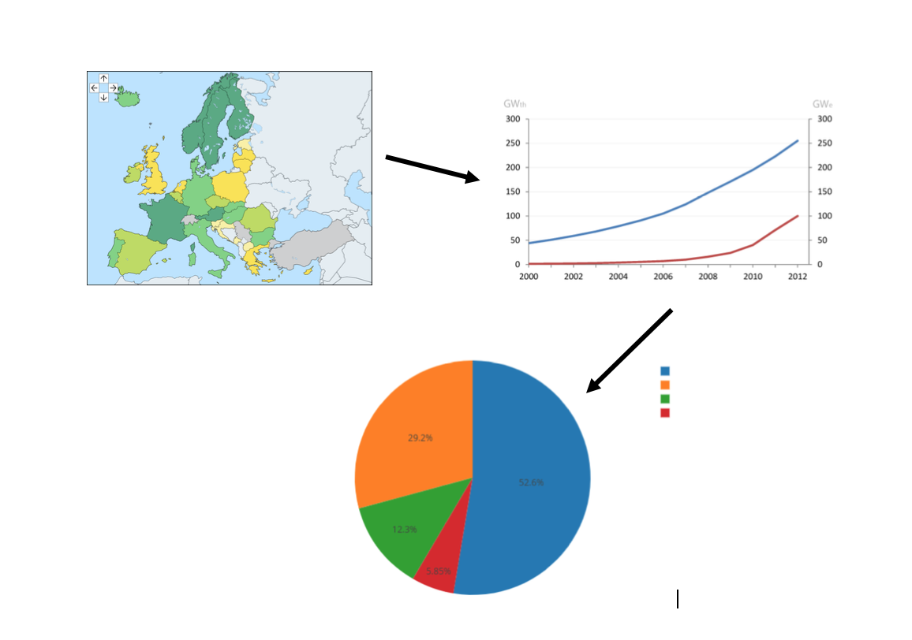

# Project Proposal:

Quinten Becker
12444057
Minor Programmeren

 #### Hoe groot is de productie van renewable energie per land en hoe is dit onderverdeeld in de verschillende sectoren; Transport, Electricity, Heating and Cooling?
 

Voor het project van de minor 'Programmeren' aan de Universiteit van Amsterdam moeten we een data visualisatie maken van een eigen gekozen (mondiaal) probleem. Dit probleem is in mijn geval het energievraagstuk, het eeuwig verbranden van fossiele brandstoffen is niet realistisch en hiervoor worden er steeds meer oplossingen gezocht.

Hierdoor is het opwekken van duurzaame 'renewable' energie  een steeds belangrijke en populaire oplossing voor dit probleem.
Deze duurzame energie kan door verschillende manieren opgewekt worden maar de meest voorkomende manieren zijn door zon, wind & water opwekking.

Mijn proposal gaat over het mondiaal gebruik van deze duurzame energie; de vragen die hierin naar voren komen zijn:

1. Interactieve wereldmap met welke landen een grote rol spelen in de energieopwekking (niet alleen duurzaam) in %.
   Interactieve wereldmap met welke landen er aan het opwekken van duurzame energie doen?
      Kan op een knop drukken, aandeel renewable energy en aandeel normale energieopwekking
      je ziet hier dus een land met kleuren die donkerder worden, hoe groter het aandeel in normalae energieopwekking of dus renewable energieopwekking.

(De duurzame energie die opgewekt wordt, welk deel is dat van de totale energieverwekking als extra data.)

2. Een line chart met de toename aan renewable energie door de jaren heen. Waar je op verschillende punten kan klikken, en de hieronder beschreven cirkeldiagram beschikbaar wordt.  Je ziet dus de toename van renewable energy van dit land door de jaren heen. Het aandeel van deze energieopwekking van elk land is een kaart geplaatst.

3.  Waarna je op elk land dat aan renewable energieopwekking doet kan drukken en er een verdeling van hoeveel procent van dat land wordt opgewekt door zon/wind & water opwekking in een cirkeldiagram.

### Data sources:
https://ec.europa.eu/eurostat/tgm/refreshTableAction.do?tab=table&plugin=1&pcode=sdg_07_40&language=en

https://www.eia.gov/beta/international/data/browser/#/?pa=0000000000000000000000000000008&c=ruvvvvvfvtvvvv1vvvvvvfvvvvvvfvvvsu20evvvvvvvvvvvvuvg&ct=0&tl_id=2-A&vs=INTL.34-12-AFG-BKWH.A&cy=2016&vo=0&v=H&end=2016&vid=6

### External Components
D3 library, misschien meerdere libraries gebruiken

### Sketch
Mijn site gaat er zo uitzien, waar je door op de interactieve wereldkaart te drukken en hierdoor toegang krijgt tot de line graph en pie chart van het desbetreffende land komt. 

### Challenges:
Het was moeilijk om de juiste Data te vinden, en vooral deze met elkaar te vergelijken. Omdat het is veel verschillende eenheden uit te drukken is. 
