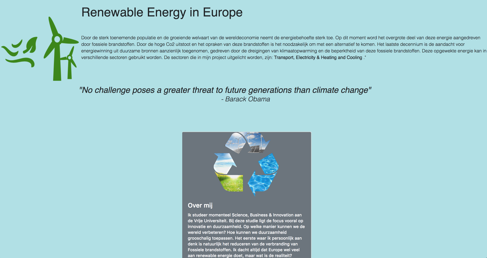
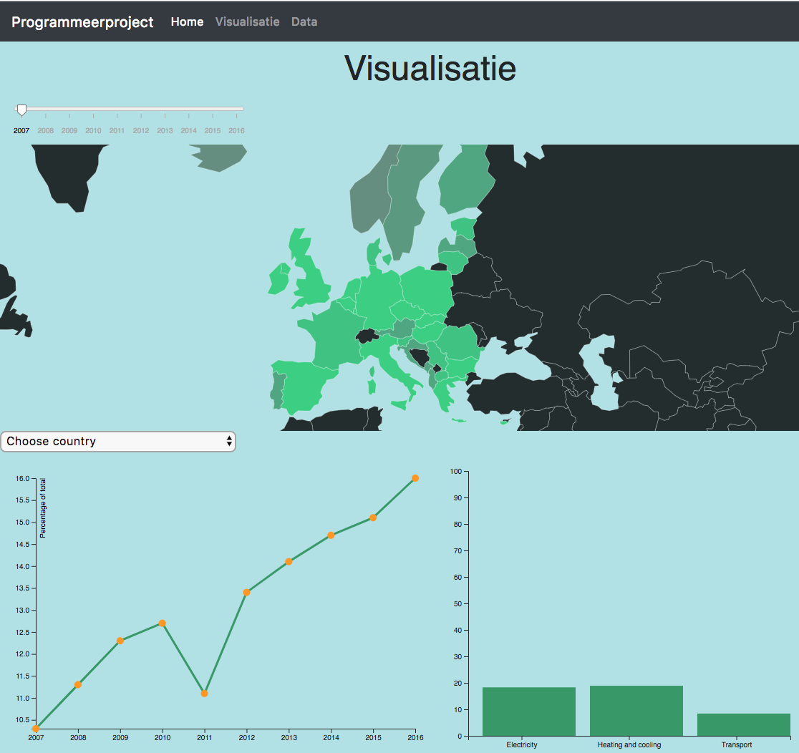

# Project Readme:

### Persoonlijke Informatie:
Quinten Becker
12444057
Minor Programmeren

### Github Pages
link 

### Product Video
link

### Samenvatting
Mijn website bevat 3 interactieve visualisaties (een wereldmap, een barchart en een linegraph). Het doel van mijn site is om beter inzicht te krijgen over het 'renewable energy' aandeel van Europeese landen en in welke sector ze deze toepassen in kaart te brengen. 

### Thuis pagina
Op mijn thuis pagina leg ik het mondiale vraagstuk (probleem) uit, hieronder heb ik ook een quote van Obama. Wat ik belangrijk vind is dat is om het bewustzijn te vergroten van de mens wat betreft klimaatverandering. 
Hieronder heb ik ook een kleine 'about me' geschreven met een uitleg waarom ik mijn project hierover heb geschreven. 

### Visualisatie pagina
Op mijn visualisatie pagina heb ik drie linked vieuws. 

#### World map
* De world map is geprojecteerd op alleen Europa.
* Hij heeft  een slider. 
  (De slider laat het jaar zien, en de wereldkaart heb ik heat sensitive gemaakt zodat je het verschil met de jaren mee kan     zien veranderen.)
* Het heeft een tooltip
  (Je kan op een land klikken en van dat land word dan de line graph gemaakt)

#### Line graph
* De line chart heeft een dropdown waaruit het jaar gekozen kan worden.
  (hier wordt dan een updated line graph van gemaakt)
* Het heeft een interactieve scatterplot
* Het heeft een tooltip
  ( Je kan op een jaar kliken waarna je de barchart van dat jaar te zien krijgt)
  
#### Bar chart
* Het heeft een tooltip

### Data 
Hier staat de link waar ik mijn data vandaan heb gehaald.

[Renewable energy](https://ec.europa.eu/eurostat/tgm/refreshTableAction.do?tab=table&plugin=1&pcode=sdg_07_40&language=en)

#### Externe componenten
* D3 versie 5
* Bootstrap

#### Copyrights
Ik heb geen copyrights op alle gebruikte data in mijn project.

### Bronnen

#### Blocks
[World map](http://bl.ocks.org/micahstubbs/8e15870eb432a21f0bc4d3d527b2d14f) - Micah Stubbs

[SLider](https://bl.ocks.org/johnwalley/e1d256b81e51da68f7feb632a53c3518) - John Walley

[Dropdown](http://bl.ocks.org/jhubley/17aa30fd98eb0cc7072f) - Jill

[D3](https://d3js.org/d3.v5.min.js)- Copyright 2019 Mike Bostock

#### Bootstrap
[Bootstrap navbar](https://www.w3schools.com/bootstrap4/bootstrap_navbar.asp) - Copyright 1999-2019 by Refsnes Data.

[Bootstrap](https://maxcdn.bootstrapcdn.com/bootstrap/4.1.3/css/bootstrap.min.css) - Copyright (c) 2011-2018 Twitter, Inc./ Copyright 2011-2018 The Bootstrap Authors

[Cloudfare](https://cdnjs.cloudflare.com/ajax/libs/popper.js/1.14.3/umd/popper.min.js) - https://cdnjs.cloudflare.com/ajax/libs/popper.js/1.14.3/umd/popper.min.js

#### Anders
[Ajax](https://ajax.googleapis.com/ajax/libs/jquery/3.3.1/jquery.min.js) - (c) JS Foundation and other contributors

[Topo Json](https://github.com/topojson/topojson-client) - Copyright 2016 Mike Bostock.

